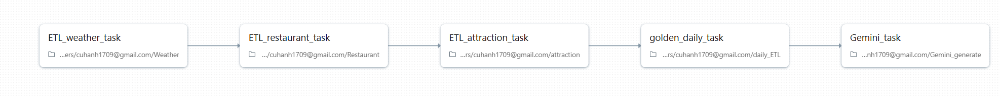
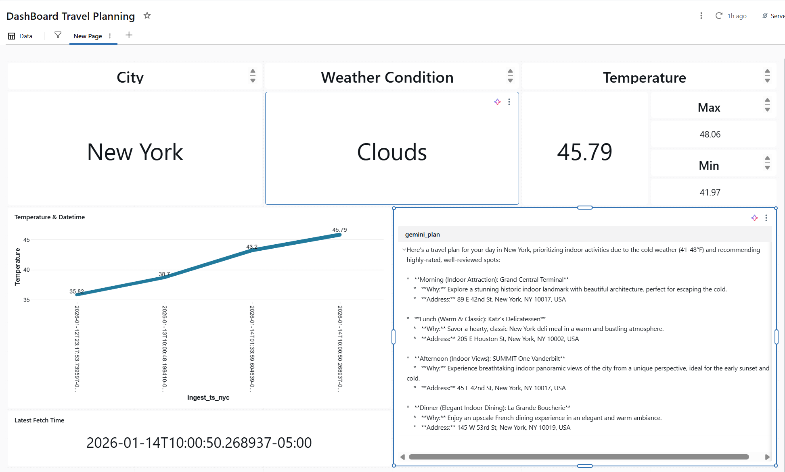

# databricks-llm-travel-planner
The project is about is an end-to-end Databricks pipeline that builds a travel recommendation system by combining real-time weather data using WeatherAPI, nearby places (restaurants &amp; attractions), and large language model (LLM) reasoning with Gemini.

The architecture implements Medallion Architecture (Bronze → Silver → Gold) to ingest, clean, enrich, and aggregate data into a high-quality daily travel context table. This curated context is then passed to Google Gemini to generate concise, personalized travel and dining recommendations based on current conditions such as weather, time of day, and place popularity.

## Project Overview

The notebook implements a full ETL (Extract, Transform, Load) cycle:
* **Extract**: Fetches current weather data for New York City via the OpenWeatherMap API and all nearby resturants and tourist attractions via PlaceAPI.
* **Transform**: Converts UTC timestamps to New York local time and utilizes Google's Gemini to generate travel planning schedule based on the weather & attractions near our location.
* **Load**: Persists the data into the Databricks Unity Catalog as both raw JSON files and a structured Delta table.
* **Orchestration**: The notebook with this ETL code is added to a job and scheduled to run every day at 10:00AM in Databricks.
* **Analytics**: The gold layer feeds a Databricks Dashboard that displays relevant weather information alongside the LLM's suggestions.

## Technical Features

**1. Weather Ingestion**
* Ingests weather data from an external Weather API and immediately cleans and normalizes it into a structured Delta table. This notebook extracts key features such as temperature, min/max values, sunrise/sunset times, and weather conditions while ensuring consistent schema and data quality.

**2. Location Ingestion Description:**
* Fetches restaurant and attraction data from the Google Places API and performs in-notebook normalization. Nested JSON fields (reviews, summaries, opening hours, parking options) are flattened and standardized before being written to Delta tables. 

**3. LLM Travelling Recommendation:**
* Reads the most recent record from the Gold daily_context table and sends structured prompt with specific inputs to Google Gemini. The LLM generates concise, weather-aware travel and dining recommendations suitable for end users.

**4. Dashboard Generation:**
* Displays all relevant information, including weather details, temperatures, nearby locations, and Gemini-generated recommendations.
* Provides an integrated, user-friendly view of the daily travel context.

## Technical Stack
* Platform: Databricks.
* Language: Python (PySpark) and SQL.
* APIs: OpenWeatherMap, PlacesAPI and GemeniAPI.
* Storage: Delta Lake and Unity Catalog Volumes.

## Configuration
Configure the API on DataBricks parameter when runs pipeline
* API_KEY: Your OpenWeatherMap API key.
* GEMINI_API_KEY: Your OpenAI API key.
* PLACE_API_KEY: Your Place API key

## Pipeline

## Dashboard

